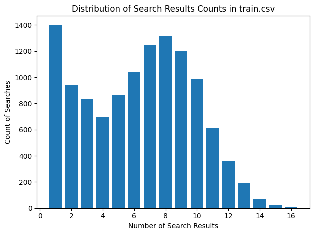
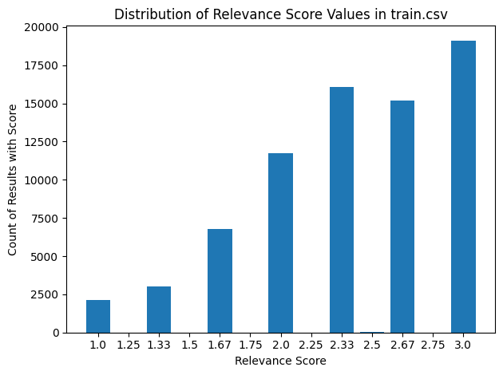

# Introduction

About a year ago, I began my journey into the world of search and match. I had previously been working on recommender systems, and I initially thought working on search would be great, the user is telling you exactly what they want! What I found was that finding and displaying relevant search results is harder than I had originally anticipated and can be a combination of an art and a science. What I hope to do in this series of blog posts is demonstrate some of the tactics that I’ve picked up along the way as well as test out some of the cutting edge techniques that are being used today.

In this series of posts I will be utilizing data from Home Depot Product Search Relevance competition that was hosted on Kaggle in 2016.  The dataset consists of queries, products, and judgments of relevance between the two. We’ll initially try out our techniques on the dataset that was released to competitiors for training and then we’ll test out our best methods on the final test set.

In these posts I’ll try to include the relevant code snippets and documentation; I’ll also post all of my notebooks on Github so that you can follow along.

In this first post, we'll explore the data, set up an Elasticsearch cluster, and run initial text queries.

# Dataset Exploration

The following is the dataset description in the original competition:

> This data set contains a number of products and real customer search terms from Home Depot's website. The challenge is to predict a relevance score for the provided combinations of search terms and products. To create the ground truth labels, Home Depot has crowdsourced the search/product pairs to multiple human raters.
> 
> 
> The relevance is a number between 1 (not relevant) to 3 (highly relevant). For example, a search for "AA battery" would be considered highly relevant to a pack of size AA batteries (relevance = 3), mildly relevant to a cordless drill battery (relevance = 2), and not relevant to a snow shovel (relevance = 1).
> 
> Each pair was evaluated by at least three human raters. The provided relevance scores are the average value of the ratings. There are three additional things to know about the ratings:
> 
> - The specific instructions given to the raters is provided in relevance_instructions.docx.
> - Raters did not have access to the attributes.
> - Raters had access to product images, while the competition does not include images.

There are three main files in the dataset that we will work with:

- **train.csv** - the training set, contains products, searches, and relevance scores
- **product_descriptions.csv** - contains a text description of each product. You may join this table to the training or test set via the product_uid.
- **attributes.csv** - provides extended information about a subset of the products (typically representing detailed technical specifications). Not every product will have attributes.

Inside of `train.csv` we learned the following:

- There are 74,067 triplets of products, search query, and relevance scores
- There are 54,667 unique products in the set
- There are 11,795 unique searches
- Each search term has an average of 6.3 products associated with it
    - An average of 4.6 of these have a relevance score higher than 2



- Search terms have an average of 19 characters
- The average relevance score is 2.4



Inside of `product_descriptions.csv` we learned the following:

- There are 124,428 product descriptions
- Every product in the training set have a description
- Descriptions have an average length of 840 characters

Inside of `product_attributes.csv` we learned the following:

- 69% of products have attributes associated with them
- There are 5411 unique attribute types
- Products with attributes have an average of 23.7 attributes

Now that we have this data loaded in, we are going to transform it slightly to make it a bit easier to use. We’ll create three datasets:

`df_products`

- This data frame has one row per product with the following columns:
    - product_uid
    - product_title
    - product_description
    - product_attributes

`df_queries`

- This dataframe has each unique search term, an id, and an indicator of if there are relevant results for that query

`df_relevance`

- This data frame has  triplets of product ids, query ids, and relevance scores

# Setting Up Elasticsearch Index

We’ll be using Elasticsearch for this series of blog posts. There’s really no reason for this other than I work with Elasticsearch in my day job and  I read “Relevant Search” by Doug Turnbull and John Berryman pretty early on.

We’ll first create an index mapping that follows the schema of our product data pretty closely:

```python
index_name = 'products'

mapping = {
    "properties": {
        "product_uid": {
            "type": "integer"
        },
        "product_title": {
            "type": "text"
        },
        "product_description": {
            "type": "text"
        },
        "product_attributes": {
            "type": "nested",
            "properties": {
                "name": {
                    "type": "text"
                },
                "value": {
                    "type": "text"
                },
                "name_value": {
                    "type": "text"
                },
            }
        },
        "query_scores": {
            "type": "nested",
            "properties": {
                "query_id": {
                    "type": "text"
                },
                "relevance": {
                    "type": "float"
                },
            }
        }
    }
}
es.indices.create(index=index_name, mappings=mapping)
```

There are two additions:

- For each product attribute title and value pair I also create a concatenation of the text into a single field. This is to capture attributes like “Grill light included: Yes” where a text match to the field name would be valuable
- If the product has any relevance judgements with a query, I include that in the producut listing. We won’t search against this, but it may be useful to have

# Running Basic Elasticsearch Text Queries

Elastic search uses an inverted index to perform efficient full-text searches. This structure maps each unique word in the document to the places it occurs, allowing for rapid querying. Search queries are highly customizable, supporting a wide range of operators for fine-tuned result retrieval.

To start with, we’ll run a basic match query from our list of queries across our newly created products index. Our query will look something like this:

```python
query_body = {
    "size": num_results,
    "query": {
        "bool": {
            "should": [
                {
                    "match": {
                        "product_title": {
                            "query": search_text,
                        }
                    }
                },
                {
                    "match": {
                        "product_description": {
                            "query": search_text,
                        }
                    }
                },
                {
                    "nested": {
                        "path": "product_attributes",
                        "query": {
                            "match": {
                                "product_attributes.name_value": {
                                    "query": search_text,
                                }
                            }
                        }
                    }
                }
            ]
        }
    }
}
```

This query searches for documents that match the “search_text” in either the “product_title”, “product_description”, or within any of the “product_attributes.name_value” fields. The use of the bool query with the should clause ensures that a document is considered a match if it matches any of these conditions.

But Elasticsearch does so much more than just retrieve matches from the index, it also scores the quality of the matches in such a way that the most relevant documents recieve the highest score. Elasticsearch uses a TF-IDF like scoring algorithm called BM25 out of the box to rank documents based on their relevance to a given query. It considers both the frequency of the term in the document and the number of documents containing the term. This allows for an effective comparison and ranking of the documents against each other.

Elasticsearch also provides the flexibility to change the effective weights of matches in different fields to fine-tuned to scoring to suit our specific needs. We’ll look at this next.

# Simple Text Relevance Tuning

Consider the following query results for “carpet grass 10 feet”:

| position | product_title | score | relevance |
| --- | --- | --- | --- |
| 1 | Scotts 10 lb. Turf Builder EZ Bermuda Grass Seed | 28.6455 |  |
| 2 | Roberts 2.125 in. Carpet Cutter Replacement Blade, For Roberts 10-154,
  10-906, 10-621GT and Many Other Carpet Cutters, (100-Pack | 26.90916 |  |
| 3 | IMAGE 32 oz. Ready-to-Spray Herbicide for St. Augustine Grass and
  Centipede Grass | 26.74438 |  |
| 4 | GREENLINE Pink Blend Artificial Grass Synthetic Lawn Turf Indoor/Outdoor
  Carpet, Sold by 12 ft. W x Customer Length | 26.30933 |  |
| 5 | GREENLINE Slate Grey Artificial Grass Synthetic Lawn Turf Indoor/Outdoor
  Carpet, Sold by 12 ft. W x Customer Length | 26.30933 |  |
| 6 | GREENLINE Caribbean Blue Artificial Grass Synthetic Lawn Turf
  Indoor/Outdoor Carpet, Sold by 6 ft. W x Customer Length | 26.30933 |  |
| 7 | GREENLINE Caribbean Blue Artificial Grass Synthetic Lawn Turf
  Indoor/Outdoor Carpet, Sold by 12 ft. W x Customer Length | 26.30933 |  |
| 8 | GREENLINE Slate Grey Artificial Grass Synthetic Lawn Turf Indoor/Outdoor
  Carpet, Sold by 6 ft. W x Customer Length | 26.30933 |  |
| 9 | GREENLINE Jade 50 7.5 ft. x 10 ft. Artificial Synthetic Lawn Turf Grass
  Carpet for Outdoor Landscape | 26.30129 | 2.33 |
| 10 | GREENLINE Jade 50 15 ft. x Your Length Artificial Synthetic Lawn Turf
  Grass Carpet for Outdoor Landscape | 25.71607 |  |

The grass seed ends up in our top position because it has matches to both “grass” and “10” in both its title and its description. Only the result in position 9 has any relevance score associated with it for this particular query. What we want is to get that product in position 9 to rank higher, as well as potentially pull some other relevant products into the top 10 results.

## Evaluating Queries

Because we’re coming at this from a data science perspective, we want to measure how well we are ranking these final results. With the help of the `pytrec_eval` package, we can pass our query results as well as the relevance judgements of this same query and get some relevance scores. In our case we’ll be using the following metrics.

- **Mean Reciprocal Rank (MRR)**: MRR measures the rank of the first relevant item found in the recommendation list. It takes the reciprocal of this rank, meaning if the first item is relevant, MRR will be 1, otherwise, it will be lower. MRR is particularly useful when there's only one relevant result or when the highest-ranked relevant item is of primary importance. It's straightforward to interpret and can be a good indicator of when a user is most likely to see their first relevant item.
- **Mean Average Precision (MAP)**: MAP averages the precision@k metric at each relevant item position in the recommendation list. It rewards the recommendation algorithm that places more items at the top of the list. It is particularly useful when there are multiple relevant results for a query, and their positions in the ranked list are important.
- **Normalized Discounted Cumulative Gain (NDCG)**: NDCG is a metric that measures the quality of the ranking by considering not only the relevance of the results but also their positions in the ranked list. It assigns higher weights to the more relevant results and lower weights to the less relevant results, based on their positions. NDCG values range from 0 to 1, with 1 representing the ideal ranking of results. It is often used when the relevance of results is graded on a multi-level scale (e.g., highly relevant, partially relevant, not relevant) rather than just binary relevance.

I like to use MRR because it’s very straightforward and easy to explain to non-technical audiences. Mean Average Precision should work well for our use case where we may have multiple highly relevant products and we want to have them all in the results. NDCG is included as it seems to be the gold standard of ranking metrics.

## Tuning Process

In order to tune the results of our queries, we’ll use the boosting functionality from Elasticsearch. Boost values allow us to “boost” the score of matches from a particular field. For instance a boost value of 2 applied to the “product title” would multiply the match score in that field by 2.

We’ll perform a grid-search over potential boost values of different fields. With each set of boost values, we’ll run through all of the queries, score them using our evaluation metrics, and the collect our results at the end.

After searching over a wide range, we find that the following boost values give us the best evaluation metrics:

```python
boosts = {"title_boost": 8,
          "description_boost": 2,
          "attributes_boost": 1}
```

Let’s rerun our query for  “carpet grass 10 feet” and see the difference in results:

| position | product_title | score | relevance |
| --- | --- | --- | --- |
| 1 | GREENLINE Jade 50 7.5 ft. x 10 ft. Artificial Synthetic Lawn Turf Grass
  Carpet for Outdoor Landscape | 118.972 | 2.33 |
| 2 | GREENLINE Classic 54 Fescue 5 ft. x 10 ft. Artificial Synthetic Lawn Turf
  Grass Carpet for Outdoor Landscape | 115.1039 | 2.67 |
| 3 | GREENLINE Classic 54 Fescue 7.5 ft. x 10 ft. Artificial Synthetic Lawn
  Turf Grass Carpet for Outdoor Landscape | 115.1039 | 3 |
| 4 | GREENLINE Pet/Sport 60 5 ft. x 10 ft. Artificial Synthetic Lawn Turf
  Grass Carpet for Outdoor Landscape | 112.7533 |  |
| 5 | GREENLINE Classic Pro 82 Spring 7.5 ft. x 10 ft. Artificial Synthetic
  Lawn Turf Grass Carpet for Outdoor Landscape | 112.5257 | 2 |
| 6 | GREENLINE Classic Premium 65 Spring 5 ft. x 10 ft. Artificial Synthetic
  Lawn Turf Grass Carpet for Outdoor Landscape | 112.2699 | 2 |
| 7 | GREENLINE Classic Premium 65 Fescue 7.5 ft. x 10 ft. Artificial Synthetic
  Lawn Turf Grass Carpet for Outdoor Landscape | 112.2699 | 1.33 |
| 8 | GREENLINE Classic Premium 65 Spring 7.5 ft. x 10 ft. Artificial Synthetic
  Lawn Turf Grass Carpet for Outdoor Landscape | 112.2699 |  |
| 9 | Turf Evolutions Deluxe Indoor Outdoor Landscape Artificial Synthetic Lawn
  Turf Grass Carpet,5 ft. x 10 ft. | 109.6246 | 3 |
| 10 | Turf Evolutions Luxurious Indoor Outdoor Landscape Artificial Synthetic
  Lawn Turf Grass Carpet,5 ft. x 10 ft. | 109.2967 | 3 |

As you can see, our original relevant result now sits in the first position, and we were able to pull 7 additional relevant results into the top 10.

The following table shows our aggregate metrics over the entire set of queries before and after tuning:

| run_name | run_time | MRR | MAP | NDCG |
| --- | --- | --- | --- | --- |
| textsearch | 90.8 | 0.27 | 0.12 | 0.18 |
| textsearch_boosted | 110 | 0.32 | 0.16 | 0.24 |
| % change | 21% | 21% | 34% | 29% |

One thing that we’ll also track is the time it takes to run all of the queries as we add more complexity to our queries.

# Conclusion

In this initial post we’ve gained some valuable insights into our product search relevance dataset. We’ve defined our evaluation metrics and we established a baseline performance for text search out of the box. We ran some light optimization over the text search to see what kind of performance gains we can get out of tuning the boost values in our queries.

With this foundation, we’ll dive deeper into more sophisticated approaches like vector embeddings and hybrid search methods in the subsequent posts.

If you want to dive deeper into the code, the notebook for all of the work above can be found here: