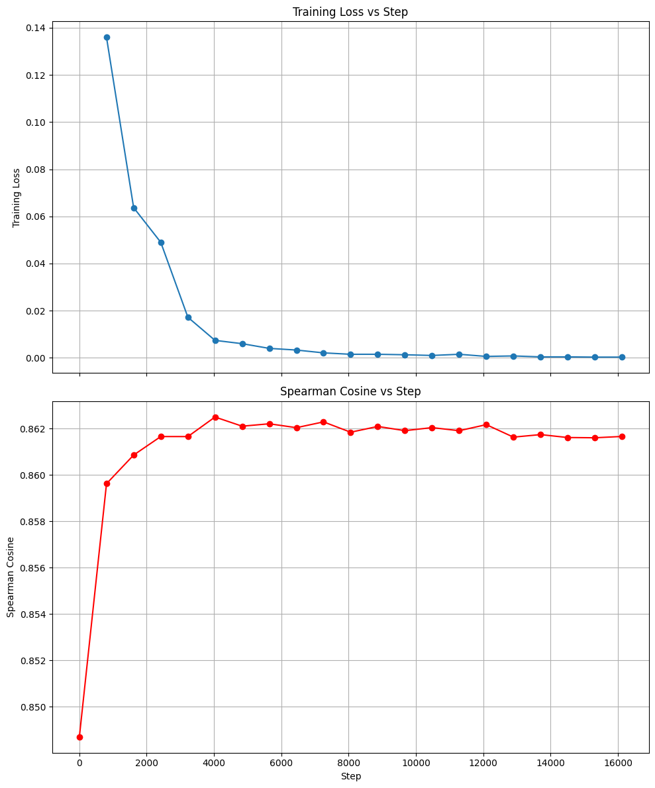
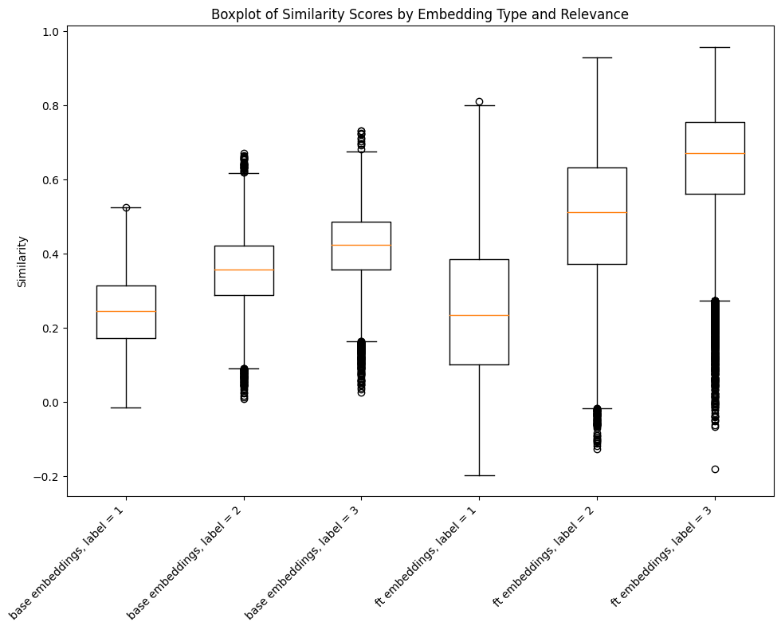

# Introduction

So far in this series we’ve focused on using and optimizing different search techniques over our Home Depot search relevance dataset. We started with running and optimizing the weights of a BM25 text search. We then added text embeddings of our products and queries so that we could use vector search. We then experimented with tuning the boosts between text search and vector search to create a hybrid search solution. Finally we used recipricol rank fusion to combine the ranking of the text and vector search without the use of boosting. In this post we’ll dive deeper into the embeddings themselves, and fine-tune our generalized pretrained model for our specific usecase.

So far in this series we've focused on using and optimizing different search techniques over our Home Depot search relevance dataset. We started with running and optimizing the weights of a BM25 text search. We then added text embeddings of our products and queries so that we could use vector search. We experimented with tuning the boosts between text search and vector search to create a hybrid search solution. Finally, we used reciprocal rank fusion to combine the ranking of the text and vector search without the use of boosting.

While these techniques have significantly improved our search results, we hypothesize that there is is a great deal of domain-specific terminology and concepts unique to our Home Depot dataset that may not be captured in the embeddings. This is the perfect use opportunity to explore fine-tuning the generalized pre-trained model for our specific use case. By adapting our model to our domain, we aim to capture more nuanced relationships between queries and products, potentially leading to even more relevant search results.

We'll explore the fine-tuning process, evaluate its impact on search performance, and discuss how it integrates with our existing search infrastructure. Whether you're looking to optimize your own search system or just curious about the latest in applied machine learning for information retrieval, this post will provide valuable insights into the power of customized embeddings.

# Fine-Tuning Embedding Models

## Why Fine-Tune?

Today’s pre-trained embedding models are trained on huge corpuses of data and offer powerful general-purpose text representations. However they may not always capture the nuances and specifics of our particular domain. Fine-tuning allows us to adapt these models to our specific use case, potentially improving search relevance in several ways:

1. Domain-Specific Vocabulary: The Home Depot dataset contains many product names, brands, and technical terms that may not be well-represented in a general-purpose model. Fine-tuning can help the model better understand and represent these domain-specific terms.
2. Context-Aware Embeddings: By training on our specific dataset, the model can learn to represent words and phrases in the context of home improvement and product search, rather than in a general context.
3. Improved Semantic Understanding: Fine-tuning can help the model better capture the relationships between queries and relevant products in our specific domain, potentially leading to more accurate vector searches.
4. Handling of Abbreviations and Jargon: Our dataset likely contains industry-specific abbreviations and jargon. Fine-tuning can teach the model to properly interpret and represent these terms.
5. Adaptation to Query and Product Description Styles: The structure and style of our queries and product descriptions may differ from the text the model was originally trained on. Fine-tuning helps the model adapt to these specific patterns.
6. Potential for Improved Performance: While general models perform well, a fine-tuned model has the potential to outperform them on our specific task, as it's tailored to our exact use case.

By fine-tuning our embedding model, we're essentially teaching it to "speak the language" of our Home Depot search dataset. This customized understanding has the potential to significantly improve the relevance of our vector search results, leading to a better overall search experience for users.

## Fine-Tuning Process

At a high level the fine tuning process works as follows:

1. Input: We provide the model with pairs of text that we consider similar or relevant to each other. In our case, these will be query-product pairs that we know are good matches.
2. Embedding Generation: The model generates embeddings for each piece of text in the pair.
3. Similarity Calculation: The model calculates a similarity score between the embeddings of each pair.
4. Loss Calculation: We compare this similarity score to our expected similarity (high for pairs we deem similar). The difference between the calculated and expected similarity is used to compute a loss value.
5. Backpropagation: This loss is then backpropagated through the model, adjusting the parameters to minimize the difference between the model's predictions and our expected outcomes.
6. Iteration: This process is repeated many times over our dataset, gradually improving the model's ability to embed similar texts closer together in the vector space.

### Data

The first thing we need to do is collect some input pairs. We’ll filter down to the query-product pairs that have the highest relevance score of 3. We’ll also use the test set of query and products so that we don’t train the model to memorize the high relevance query-product pairs that are within our existing index. We simply create `InputExample` instances for each of these pairs and put them into a `DataLoader` :

```python
from sentence_transformers import datasets, InputExample

batch_size = 16

train_examples = [
    InputExample(texts=[t1, t2])
    for t1, t2 in zip(
        train_data['search_query'], train_data['product_text_string']
    )
]

loader = datasets.NoDuplicatesDataLoader(
    train_examples, batch_size=batch_size
)
```

### Loss Function

The next step in our fine-tuning process is defining our loss function. This function calculates a loss value that represents how well the model's similarity scores align with the expected similarities in our training set.

For our use case, we'll employ `MultipleNegativesRankingLoss()` [documentation](https://sbert.net/docs/package_reference/sentence_transformer/losses.html#multiplenegativesrankingloss).  This loss function is particularly well-suited for our task for several reasons:

1. Positive Pairs Only: It only requires positive pairs of text (in our case, query-product pairs that we know are good matches). This is advantageous as we don't need to explicitly define negative examples.
2. Ranking Alignment: The loss value is defined based on how well it ranks products, which directly aligns with our search relevance use case. This makes it ideal for training embeddings in a retrieval setup.
3. Batch Optimization: The function works by creating batches of pairs, where each pair consists of an anchor (query) and a positive example (relevant product). It then uses other products in the batch as negative examples, which allows for efficient computation and typically improves performance with larger batch sizes.

The function works as follows:

1. For each query-product pair (q_i, p_i) in a batch, it computes the similarity between the query embedding and all product embeddings in the batch.
2. It treats the matching product p_i as the positive example and all other products in the batch as negative examples.
3. The loss is then calculated based on how well the model ranks the positive example higher than all the negative examples.

By using this loss function, we're effectively teaching our model to embed queries and their relevant products closer together in the vector space, while pushing less relevant products further apart. This should result in embeddings that more accurately capture the relevance relationships in our Home Depot dataset, and provide for better rankings in our search results.

### Evaluating

We want to create an evaluator of held out test data so that we can evaluate the model before, during, and after training. Unfortunately, there is no pre-built evaluator that uses `MultipleNegativesRankingLoss()` . We can, however, create a dataset of positive pairs and negative pairs that we can pass to the `EmbeddingSimilarityEvaluator()` . We can create negative pairs by randomly creating pairs between queries and products. 

```python
pos_test = test_data[['product_text_string', 'search_query']].reset_index(drop=True).copy()
pos_test['similarity'] = 1

np.random.seed(12)
pos_test['rand_merge_1'] = np.random.choice(range(len(pos_test)), size=len(pos_test), replace=False)
pos_test['rand_merge_2'] = np.random.choice(range(len(pos_test)), size=len(pos_test), replace=False)

neg_test = pos_test[['product_text_string', 'rand_merge_1']].merge(pos_test[['search_query', 'rand_merge_2']], how = 'left', left_on = 'rand_merge_1', right_on = 'rand_merge_2')
neg_test['similarity'] = 0

pos_neg_test = pd.concat([pos_test, neg_test])
pos_neg_test = pos_neg_test.sample(frac=1)

evaluator = evaluation.EmbeddingSimilarityEvaluator(
    list(pos_neg_test["search_query"]),
    list(pos_neg_test["product_text_string"]),
    [float(x) for x in pos_neg_test["similarity"]],
    batch_size=batch_size
)
```

### Training

We now have everything we need to kick our fine-tuning!

```python
loss = losses.MultipleNegativesRankingLoss(model)

epochs = 10
warmup_steps = int(len(loader) * epochs * 0.1)

num_steps_per_epoch = len(loader)
total_steps = (len(loader) / batch_size) * epochs
eval_steps = num_steps_per_epoch // 2

model.fit(
    train_objectives=[(loader, loss)],
    epochs=epochs,
    evaluator=evaluator,
    evaluation_steps=eval_steps,
    warmup_steps=warmup_steps,
    show_progress_bar=True,
)
```

### Results

| Metric | Pretrained | Finetuned |
| --- | --- | --- |
| Pearson Correlation | 0.8487 | 0.8617 |
| Spearman Rank Correlation | 0.8765 | 0.9388 |
| MNR Loss | 0.1359 | 0.0003 |

After 10 epochs of training we saw a modest boost 1.5% increase in the Pearson correlation of cosine similarities in our evaluator. We saw a greater 7.1% increase in the Spearman Rank correlation of  cosine similarities in our evaluator. This increase in the Spearman Rank Correlation is particularly encouraging because it suggests that the fine-tuned model is better at ranking relevant products correctly.

We also saw a drastic drop off in our MNR loss function. In looking at the scores of the evaluation set I think we can safely say we’re not overfitting, however we probably should have included an early stopping check during our training run. The plot below shows Spearman Rank Correlation and MNR loss over the training steps:  


### Additional Evaluation

There are a few other ways that we can examine the effectiveness of our fine-tuning process. One is to take a look at the distribution of similarity scores for each of the relevance labels in our dataset. The box-plot below shows just that for the base model and the fine-tuned model:



As you can see the similarities between query and product embeddings spread out slightly but were also pushed upwards towards one for highly relevant pairs and downward towards zero for low relevance pairs. This give us a wider total distribution and also separates the irrelevant pairs from the relevant pairs by a greater distance. 

Another check we can do is to look at known positive pairs from the labeled set and see which of them saw the most improvement in their embedding similarities. The top five are in the table below:

| search_term | product_text_string | base_similarity | ft_similarity |
| --- | --- | --- | --- |
| vacume | RIDGID 14-gal. Professional Wet/Dry Vacuum Thi... | 0.144208 | 0.748082 |
| post sleeveee | RDI Crossover 6 in. x 6 in. x 54 in. Post Slee... | 0.276639 | 0.86475 |
| sheet metal | Crown Bolt 24 in. x 1/2 in. x 12 in. Plain Met... | 0.261905 | 0.844295 |
| black bench | Tradewinds Oasis 6 ft. Textured Black Bench wi... | 0.337759 | 0.903013 |
| vaccum for dw745 | Dirt Devil Express V6 Bagless Wet/Dry Handheld... | 0.209008 | 0.767965 |

What’s interesting is it seems we taught the model to recognize that “vacume” and “vaccum” mean “vacuum” and that “sleeveee” means “sleeve”. The changes in the other two queries are not as obvious, but the products do seem to match the query.

We could also look at known positive pairs from the labeled set and see which of them saw the most significant deterioration in their embedding similarities. The top five are in the table below: 

| search_term | product_text_string | base_similarity | ft_similarity |
| --- | --- | --- | --- |
| everbilt sloted | Everbilt #8 x 1-1/2 in. Zinc-Plated Hex-Head S... | 0.471475 | 0.141895 |
| owt | OWT Ornamental Wood Ties 6 in. x 6 in. Laredo ... | 0.325656 | 0.003995 |
| GLACIER BAY BATHROOM VANITY | Glacier Bay Modular 30-1/2 in. W x 18-3/4 in. ... | 0.615123 | 0.307893 |
| unique home design | Unique Home Designs 3 in. White Projection Bra... | 0.322623 | 0.01597 |
| everbilt sloted | Everbilt #10 x 3/4 in. Zinc-Plated Hex-Head Sl... | 0.466274 | 0.160345 |

It’s hard to put my finger on anything of note here other than the “everbilt slotted“ query shows up twice for some reason, perhaps there’s some bad training data with that term. Another interesting thing to note is that in the other three examples there is almost a direct text match, so hopefully the text matching module of our RRF will help with these results.

# Using Fine-Tuned Embeddings

Now that we have our fine-tuned model, it's time to evaluate its performance on our data. To do this, we will embed and index the product data following the same process we used in the [vector search post](https://github.com/billyhines/search-relevance/blob/main/blog-posts/post2.md). Based on our previous findings, we'll focus on embedding the entire product string, as this method consistently yielded the best results. This approach will allow us to directly assess the impact of fine-tuning on our most effective embedding strategy.

We'll also integrate these new embeddings into our reciprocal rank fusion (RRF) queries, which previously demonstrated the best overall performance. By combining our fine-tuned model with our optimized RRF approach, we aim to further enhance our search relevance.

We will evaluate the performance using the same metrics as before: Mean Reciprocal Rank (MRR), Mean Average Precision (MAP), and Normalized Discounted Cumulative Gain (NDCG). This consistent methodology will allow us to directly compare the results of our fine-tuned model against those of the pre-trained model. We expect to see improvements in search relevance, particularly for queries involving domain-specific terminology or concepts unique to our Home Depot dataset.

| Name | MRR | MAP | NDCG | Run Time |
| --- | --- | --- | --- | --- |
| textsearch | 0.261 | 0.113 | 0.17 | 178.5 |
| textsearch_boosted | 0.318 | 0.149 | 0.218 | 207.4 |
| vectorsearch | 0.331 | 0.159 | 0.237 | 509.6 |
| vectorsearch_multifield | 0.241 | 0.097 | 0.156 | 623 |
| vectorsearch_multifield_boosted | 0.255 | 0.106 | 0.168 | 662.4 |
| hybrid | 0.325 | 0.163 | 0.238 | 662.6 |
| hybrid_boosted | 0.342 | 0.17 | 0.251 | 716.3 |
| rrf | 0.361 | 0.174 | 0.26 | 4026.2 |
| rrf_multi | 0.328 | 0.148 | 0.227 | 7013.1 |
| vectorsearch_finetune | 0.382 | 0.182 | 0.276 | 203.4 |
| rrf_finetune | 0.383 | 0.186 | 0.279 | 1175.5 |

As you can see, our RRF with the fine-tuned embedding now gives us our best results. The fine-tuning increases the vector search performance by ~15% across all of the metrics. The fine-tuned embeddings also increased our RRF scores by ~7% across all of the metrics. I think we can safely say that our fine-tuning effort was a success!

# Conclusion

In the post we showed how fine-tuning the embeddings for the Home Depot search relevance dataset can yield some impressive results. By adapting a pre-trained model to our specific domain, we've significantly improved the performance of both our vector search and reciprocal rank fusion (RRF) approaches.

Key takeaways from this experiment include:

1. Training Evaluation: The increase in Spearman Rank Correlation (7.1%) during the fine-tuning process indicated that our model became significantly better at ranking relevant products correctly, which directly translates to improved search results.
2. Query Evaluation: The fine-tuned model showed substantial improvements, with a 15% increase in performance across all metrics for vector search and a 7% increase for RRF queries. This underscores the value of tailoring embeddings to your specific domain.

These results demonstrate that investing time in fine-tuning embeddings can yield substantial benefits for domain-specific search tasks.

Looking ahead, potential next steps could include:

- Exploring more sophisticated fine-tuning techniques or loss functions
- Investigating the impact of larger or more diverse training datasets

By continually refining our approach and leveraging the power of customized embeddings, we can push the boundaries of search relevance and deliver increasingly accurate and efficient results to users.

If you want to dive deeper into the code, the notebooks for all of the work above can be found here:
* [5-finetune.ipynb](https://github.com/billyhines/search-relevance/blob/main/notebooks/5-finetune.ipynb)
* [6-finetune-vector-rrf.ipynb](https://github.com/billyhines/search-relevance/blob/main/notebooks/6-finetune-vector-rrf.ipynb)
* [7-finetine-evaluation.ipynb](https://github.com/billyhines/search-relevance/blob/main/notebooks/7-finetine-evaluation.ipynb)